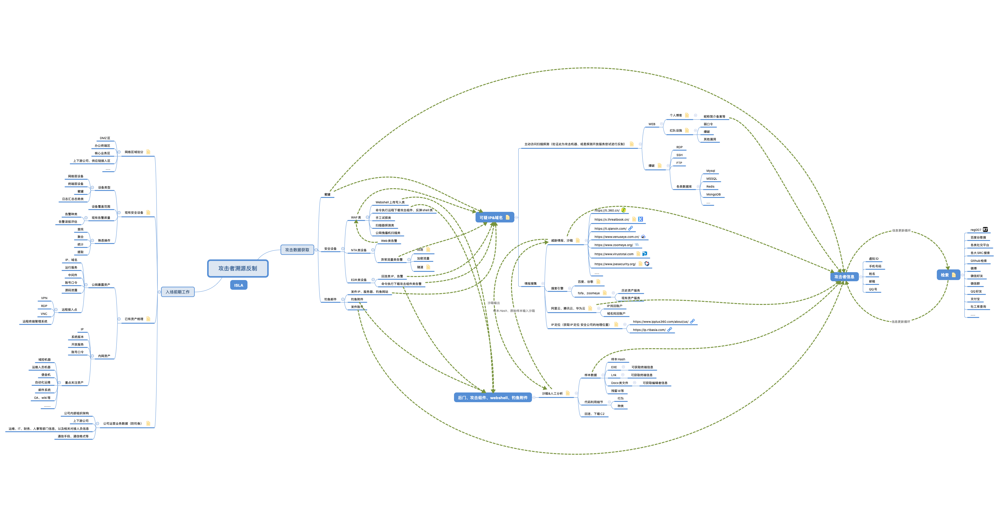

收集的微信公众号好文

# 一、红队

## 1.基础设施

包括工具开发/使用、环境搭建、C2 修改/隐匿

1.  [ATT&CK矩阵的攻与防.html](ATT&CK矩阵的攻与防.html) 
2.  [红队标准手册.html](红队标准手册.html) 
3.  [红队指南.pdf](红队指南.pdf) 
4.  [红蓝对抗｜蜜罐的几招重要战术布防！.html](红蓝对抗｜蜜罐的几招重要战术布防！.html) 
5.  [红队必备-防蜜罐抓到被打断腿.html](红队必备-防蜜罐抓到被打断腿.html)  
6.  [批量截获机场节点：科学上网工具安全分析.html](批量截获机场节点：科学上网工具安全分析.html) 
7.  [红蓝对抗』远控软件小技巧.html](红蓝对抗』远控软件小技巧.html) 
8.  [基于Caddy实现的C2前置代理 - RedCaddy.html](基于Caddy实现的C2前置代理 - RedCaddy.html) 
9.  [面向ChatGPT开发Nuclei漏洞模版解析 • 😊 阿浪的小破站 ❤️.html](面向ChatGPT开发Nuclei漏洞模版解析 • 😊 阿浪的小破站 ❤️.html) 
10.  [C2隐匿-云函数&域前置.html](C2隐匿-云函数&域前置.html) 
11.  [干货_防蓝队溯源tips.html](干货_防蓝队溯源tips.html) 
12.   [红队行动守则 _ 倾旋的博客.html](红队行动守则 _ 倾旋的博客.html) 
13.   [勉强能用 匿名上网方案.html](勉强能用 匿名上网方案.html) 
14.   [如何快速合法地获取到一张长期可用的境外手机卡！我的四种方法！轻松注册各种APP！.html](如何快速合法地获取到一张长期可用的境外手机卡！我的四种方法！轻松注册各种APP！.html) 

### C2

1.  [Cobalt Strike系列｜从0开始破解.html](Cobalt Strike系列｜从0开始破解.html) 
2.  [CobaltStrike非注入截屏BOF.html](CobaltStrike非注入截屏BOF.html) 
3.  [Cobalt Strike使用Cross C2上线Linux.html](Cobalt Strike使用Cross C2上线Linux.html) 
4.  [Cobalt Strike与YARA：我能拥有你的签名吗？.html](Cobalt Strike与YARA：我能拥有你的签名吗？.html) 
5.  [CS 4.7 Stager 逆向及 Shellcode 重写.html](CS 4.7 Stager 逆向及 Shellcode 重写.html) 
6.  [使用 Visual Studio 开发 CS 的 BOF.html](使用 Visual Studio 开发 CS 的 BOF.html) 
7.  [使用合法消息服务平台作为C2通道（二）.html](使用合法消息服务平台作为C2通道（二）.html)
8.  [集权系统即C2-Windows Admin Center（一）.html](集权系统即C2-Windows Admin Center（一）.html) 
9.  [干货 _ 通过人工准入实现C2上线.html](干货 _ 通过人工准入实现C2上线.html) 
10.  [CobaltStrike WebServer特征分析.html](CobaltStrike WebServer特征分析.html) 
11.  [Havoc+Harriet，绕过EDR方案.html](Havoc+Harriet，绕过EDR方案.html) 
12.   [C2 前端流量控制工具 - RedGuard.html](C2 前端流量控制工具 - RedGuard.html) 
13.   [CS二开记录.html](CS二开记录.html) 
14.   [一款基于Web界面的C2远控工具Manjusaka.html](一款基于Web界面的C2远控工具Manjusaka.html) 
15.  [云上天然cs远控.html](云上天然cs远控.html) 
16.   [「更新」Visual-Studio-BOF-template.html](「更新」Visual-Studio-BOF-template.html) 
17.   [一种无文件落地技术(BOF).html](一种无文件落地技术(BOF).html) 

### 隧道

1.  [技术干货 _ 内网渗透之SOCKS代理的5类基本场景.html](技术干货 _ 内网渗透之SOCKS代理的5类基本场景.html) 
2.  [内网代理和穿透工具的分析记录.html](内网代理和穿透工具的分析记录.html) 
3.  [四步学会Frp构建多层内网通信隧道！.html](四步学会Frp构建多层内网通信隧道！.html) 
4.  [内网穿透.xlsx](内网穿透.xlsx) 
5.  [【超详细 _ 内网穿透】四步学会Frp构建多层内网通信隧道！.html]([超详细 _ 内网穿透]四步学会Frp构建多层内网通信隧道！.html) 
6.  [内网渗透中常用的隧道工具.html](内网渗透中常用的隧道工具.html) 
7.  [红蓝对抗之隐蔽通信应用及防御 - 博客 - 腾讯安全应急响应中心.html](红蓝对抗之隐蔽通信应用及防御 - 博客 - 腾讯安全应急响应中心.html) 
8.   [记两次Bypass流量拦截搭隧道.html](记两次Bypass流量拦截搭隧道.html) 
9.   [内网穿透学习-2-Suo5(HTTP-jsp).html](内网穿透学习-2-Suo5(HTTP-jsp).html) 

## 2.内网

1.  [内网基础小结 (实际操作篇).html](内网基础小结 (实际操作篇).html) 
2.  [内网远程控制总结.html](内网远程控制总结.html) 
3.  [三层内网下的域渗透.html](三层内网下的域渗透.html) 
4.  [渗透攻击红队内网 APT 入门考核靶场 Writeup.html](渗透攻击红队内网 APT 入门考核靶场 Writeup.html) 
5.  [绕过杀软进行横向移动.html](绕过杀软进行横向移动.html) 
6.  [内网渗透.pdf](内网渗透.pdf) 
7.  [内网渗透tips.MD](内网渗透tips.MD) 
8.  [内网渗透测试：内网横向移动基础总结 - FreeBuf网络安全行业门户.html](内网渗透测试：内网横向移动基础总结 - FreeBuf网络安全行业门户.html) 
9.  [内网中常见软件的凭据利用.html](内网中常见软件的凭据利用.html) 
10.  [红蓝对抗之Windows内网渗透 - 博客 - 腾讯安全应急响应中心.html](红蓝对抗之Windows内网渗透 - 博客 - 腾讯安全应急响应中心.html) 

## 3.域相关

域攻击图谱

1.  [内网渗透 SCCM获取计算机用户_密码.html](内网渗透]SCCM获取计算机用户_密码.html) 
2.  [权限提升 - 通过 Kerberos 将服务帐户升级到 LocalSystem.html](权限提升 - 通过 Kerberos 将服务帐户升级到 LocalSystem.html) 
3.  [域渗透 _ 域控权限维持DSRM域后门.html](域渗透 _ 域控权限维持DSRM域后门.html) 
4.  [新一代Kerberos攻击 _ 钻石票据与蓝宝石票据.html](新一代Kerberos攻击 _ 钻石票据与蓝宝石票据.html) 
5.  [干货_常见域后门技术总结与分析利用.html](干货_常见域后门技术总结与分析利用.html) 
6.  [Active Directory CS的几种打法.html](Active Directory CS的几种打法.html)
7.  [域控被突破的几种途径v2.html](域控被突破的几种途径v2.html) 
8.  [域控提权合集 - 先知社区.html](域控提权合集 - 先知社区.html) 
9.  [域渗透中文翻译版.xmind](域渗透中文翻译版.xmind) 
10.  [ntds.dit导出与利用总结 html](3.1ntds.dit导出与利用总结 (1).html)
11.  [利用卷影拷贝服务提取ntds.dit.html](利用卷影拷贝服务提取ntds.dit.html) 
12.  [Certified_Pre-Owned.pdf](Certified_Pre-Owned.pdf) 
13.  [Active Directory 域权限提升漏洞（CVE-2022-26923）分析.html](Active Directory 域权限提升漏洞（CVE-2022-26923）分析.html) 
14.  [AS-REP Roasting攻击 - 嘶吼 RoarTalk.html](AS-REP Roasting攻击 - 嘶吼 RoarTalk - 回归最本质的信息安全,互联网安全新媒体,4hou.com.html) 
15.  [内网渗透 _ 4.域横向之PTH&PTT&PTK.html](内网渗透 _ 4.域横向之PTH&PTT&PTK.html) 
16.  [内网渗透 _ 横向移动与域控权限维持方法总结.html](内网渗透 _ 横向移动与域控权限维持方法总结.html) 
17.  [内网渗透 _ 域渗透之SPN服务主体名称 - 云+社区 - 腾讯云.html](内网渗透 _ 域渗透之SPN服务主体名称 - 云+社区 - 腾讯云.html) 
18.  [浅谈域渗透中的组策略及gpp运用.html](浅谈域渗透中的组策略及gpp运用.html) 
19.  [浅析域内NTLM Relay攻击 - FreeBuf网络安全行业门户.html](浅析域内NTLM Relay攻击 - FreeBuf网络安全行业门户.html) 
20.  [深入分析CVE-2022-26923 ADCS权限提升漏洞.html](深入分析CVE-2022-26923 ADCS权限提升漏洞.html) 
21.  [技术讨论 _ 一次详细的Kerberoast攻击演示 - FreeBuf网络安全行业门户 (1).html](技术讨论 _ 一次详细的Kerberoast攻击演示 - FreeBuf网络安全行业门户 (1).html) 
22.   [Active Directory 域攻击面 _ TOP 10 攻击方向（上）.html](Active Directory 域攻击面 _ TOP 10 攻击方向（上）.html) 
23.   [AD攻防-域用户HashDump追踪之道 - FreeBuf网络安全行业门户.html](AD攻防-域用户HashDump追踪之道 - FreeBuf网络安全行业门户.html) 
24.   [奇安信攻防社区-ADCS小结.html](奇安信攻防社区-ADCS小结.html) 

​    

## 4.技巧/经验

### 攻击手法总结

1.  [个人渗透技巧汇总（避坑）笔记.html](个人渗透技巧汇总（避坑）笔记.html) 
2.  [红队打点突破口总结（建议收藏）.html](红队打点突破口总结（建议收藏）.html) 
3.  [集权系统Vcenter打法总结.html](集权系统Vcenter打法总结.html) 
4.  [Vcenter攻击手法总结.html](Vcenter攻击手法总结.html) 
5.  [Fastjson不出网利用总结.html](Fastjson不出网利用总结.html) 
6.  [Fastjson总结.html](Fastjson总结.html) 
7.  [未授权访问漏洞集合带环境及解题.pdf](未授权访问漏洞集合带环境及解题.pdf) 
8.  [几次护网小结之红队打点及小技巧.html](几次护网小结之红队打点及小技巧.html) 
9.  [重生之我是赏金猎人合订本 (1).pdf](重生之我是赏金猎人合订本 (1).pdf) 
10.  [安全攻防 _ Windows权限维持方法总结！.html](安全攻防 _ Windows权限维持方法总结！.html) 
11.  [新鲜的实战思路分享.html](新鲜的实战思路分享.html) 
12. [远程下载的通用替代方案 ｜ 红队攻防.html](远程下载的通用替代方案 ｜ 红队攻防.html) 
13.  [命令行终端下载指令大全(Win + Linux).html](命令行终端下载指令大全(Win + Linux).html)
14.  [100个生活小妙招-极限环境下写入Webshell.html](100个生活小妙招-极限环境下写入Webshell.html) 
15.  [干货 _ 红队和漏洞挖掘中那些关于_文档_的妙用（下）.html](干货 _ 红队和漏洞挖掘中那些关于_文档_的妙用（下）.html) 
16.  [干货 _ 红队和漏洞挖掘中那些关于”文档“的妙用（上）.html](干货 _ 红队和漏洞挖掘中那些关于"文档"的妙用（上）.html) 
17.  [干货分享 _ SpringBoot渗透总结.html](干货分享 _ SpringBoot渗透总结.html) 
18.   [奇安信攻防社区-手把手教你Linux提权.html](奇安信攻防社区-手把手教你Linux提权.html) 
19.   [奇安信攻防社区-手把手教你Windows提权.html](奇安信攻防社区-手把手教你Windows提权.html) 
20.   [Red Team _ vCenter后渗透利用.html](Red Team _ vCenter后渗透利用.html) 

### 实战分享

1.  [实战分享 _ 记一红蓝对抗之Solr-RCE实战绕过（建议收藏）.html](实战分享 _ 记一红蓝对抗之Solr-RCE实战绕过（建议收藏）.html) 
2.  [奇安信攻防社区-记一次攻防演练实战总结.html](奇安信攻防社区-记一次攻防演练实战总结.html) 
3.  [一次煎熬的护网打点经历 - FreeBuf网络安全行业门户.html](一次煎熬的护网打点经历 - FreeBuf网络安全行业门户.html) 
4.  [第71篇：某银行外网打点到内网核心区红队评估复盘.html](第71篇：某银行外网打点到内网核心区红队评估复盘.html) 
5.  [第72篇：近年HVV、红队攻防比赛中常见外围打点漏洞的分析与总结.html](第72篇：近年HVV、红队攻防比赛中常见外围打点漏洞的分析与总结.html) 
6.  [通过HTTP隧道上线不出网的机子(小日子过的不错的网站).html](通过HTTP隧道上线不出网的机子(小日子过的不错的网站).html) 
7.  [WEB中隐藏攻击面的寻找挖掘.html](WEB中隐藏攻击面的寻找挖掘.html) 
8.  [Joomla Unauthorized_后_渗透到RCE.html](Joomla Unauthorized_后_渗透到RCE.html) 
9.  [红队评估 _ 给学校一点小小的学生震撼.pdf](红队评估 _ 给学校一点小小的学生震撼.pdf) 
10.  [苛刻条件下_C2上传执行骚姿势 - AabyssZG's Blog.html](苛刻条件下_C2上传执行骚姿势 - AabyssZG's Blog.html) 
11.  [ateam-这是一篇“不一样”的真实渗透测试案例分析文章.html](ateam-这是一篇"不一样"的真实渗透测试案例分析文章.html) 
12.  [记一次某地市小规模公司红队实战.html](记一次某地市小规模公司红队实战.html) 
13.  [某攻防简单记录.html](某攻防简单记录.html) 
14.  [利用HOSTS碰撞突破边界.html](利用HOSTS碰撞突破边界.html) 
15.  [XXXX第X次内部红蓝对抗 - 先知社区.html](XXXX第X次内部红蓝对抗 - 先知社区.html) 
16.  [冰蝎、蚁剑过流量监控改造及红队经典案例分享.pdf](冰蝎、蚁剑过流量监控改造及红队经典案例分享.pdf) 
17.  [记一次团队内部的红蓝对抗-攻击篇 - 先知社区.html](记一次团队内部的红蓝对抗-攻击篇 - 先知社区.html) 
18.   [盲判断目标的fastjson版本.html](盲判断目标的fastjson版本.html) 
19.   [RDP连接多开方法与利用思路.html](RDP连接多开方法与利用思路.html) 
20.   [渗透测试｜远程桌面在内网渗透中的各种利用姿势.html](渗透测试｜远程桌面在内网渗透中的各种利用姿势.html) 
21.   [原创 _ 浅谈Spring actuator env endpoint的一个误区.html](原创 _ 浅谈Spring actuator env endpoint的一个误区.html) 
22.   [【Office 365】通过 OneDrive 枚举.html]([Office 365]通过 OneDrive 枚举.html) 
23.   [【攻防小词条01 _ 痕迹清理】Defender扫描与威胁记录.html]([攻防小词条01 _ 痕迹清理]Defender扫描与威胁记录.html) 
24.   [【攻防小词条02 _ 内网渗透】非明文密码认证RDP服务.html]([攻防小词条02 _ 内网渗透]非明文密码认证RDP服务.html) 
25.   [实战 _ 无视杀软使用远控工具进行横向移动Tips.html](实战 _ 无视杀软使用远控工具进行横向移动Tips.html) 

## 5.Win/免杀

### Windows 基础

1. [Windows安全.md](Windows安全.md)  
2. [原创 _ 深入解析pe结构（上）.html](原创 _ 深入解析pe结构（上）.html) 
3.  [原创 _ 深入解析pe结构（下）.html](原创 _ 深入解析pe结构（下）.html) 
4.  [windows机制初探.html](windows机制初探.html) 
5.  [windows上凭证获取.html](windows上凭证获取.html) 
6.  [【短篇】进程：是谁创建了我？.html]([短篇]进程：是谁创建了我？.html) 
7. [技术分享｜死磕RDP协议，从截图和爆破说起.html](技术分享｜死磕RDP协议，从截图和爆破说起.html) 
8. [利用系统正常机制进行Lsass Dump（一）.html](利用系统正常机制进行Lsass Dump（一）.html) 
9. [浅谈Windows下进入内核的全过程.html](浅谈Windows下进入内核的全过程.html) 
10. [[杂谈]不忽视信任的力量--Windows内核对抗入门.html]([杂谈]不忽视信任的力量--Windows内核对抗入门.html) 
11. [_Net内存加载与卸载探讨.html](_Net内存加载与卸载探讨.html) 
12. [syscall的前世今生 - 跳跳糖.html](syscall的前世今生 - 跳跳糖.html) 
13. [APC注入.html](APC注入.html) 
14. [Mimikatz Explorer - Sekurlsa__MSV.html](Mimikatz Explorer - Sekurlsa__MSV.html) 
15. [shellcode loader的编写.html](shellcode loader的编写.html) 
16. [shellcode编写探究.html](shellcode编写探究.html) 
17. [1earn_mimikatz.md at master · ffffffff0x_1earn.html](1earn_mimikatz.md at master · ffffffff0x_1earn.html) 
18. [从mimikatz学习Windows安全之访问控制模型（一） - 安全客，安全资讯平台.html](从mimikatz学习Windows安全之访问控制模型（一） - 安全客，安全资讯平台.html) 
19. [第01课：Mimikatz 获取系统密码攻防研究.html](第01课：Mimikatz 获取系统密码攻防研究.html) 
20. [WMI攻守之道 - 跳跳糖.html](WMI攻守之道 - 跳跳糖.html) 
21. [WMI检测思路与实现 - 跳跳糖.html](WMI检测思路与实现 - 跳跳糖.html) 
22. [【技术分享】从Mimikatz 解读windows 下的协议.html]([技术分享]从Mimikatz 解读windows 下的协议.html) 
23. [DLL劫持 · 语雀.pdf](DLL劫持 · 语雀.pdf) 
24. [记DLL劫持的学习.html](记DLL劫持的学习.html) 
25. [Mimikatz详细使用总结 - 跳跳糖.html](Mimikatz详细使用总结 - 跳跳糖.html) 
26.  [动态寻找函数地址.html](动态寻找函数地址.html) 
27.  [奇安信攻防社区-深入分析PE结构(二).html](奇安信攻防社区-深入分析PE结构(二).html) 
28.  [奇安信攻防社区-深入分析PE结构(三).html](奇安信攻防社区-深入分析PE结构(三).html) 
29.  [奇安信攻防社区-深入分析PE结构(一).html](奇安信攻防社区-深入分析PE结构(一).html) 
30.  [奇安信攻防社区-深入学习Win32(二).html](奇安信攻防社区-深入学习Win32(二).html) 
31.  [奇安信攻防社区-深入学习Win32(一).html](奇安信攻防社区-深入学习Win32(一).html) 
32.  [奇安信攻防社区-AMSI对抗绕过小结.html](奇安信攻防社区-AMSI对抗绕过小结.html) 
33.  [奇安信攻防社区-dump lsass小结.html](奇安信攻防社区-dump lsass小结.html) 
34.  [奇安信攻防社区-Peb小结.html](奇安信攻防社区-Peb小结.html) 
35.  [奇安信攻防社区-免杀初探(二).html](奇安信攻防社区-免杀初探(二).html) 
36.  [奇安信攻防社区-免杀初探(三).html](奇安信攻防社区-免杀初探(三).html) 
37.  [奇安信攻防社区-免杀初探(四).html](奇安信攻防社区-免杀初探(四).html) 
38.  [奇安信攻防社区-免杀初探(一).html](奇安信攻防社区-免杀初探(一).html) 
39.  [奇安信攻防社区-线程同步的八种利用方法小结.html](奇安信攻防社区-线程同步的八种利用方法小结.html) 

### BypassAV

1.  [从一次攻击过程看EDR的作用.html](从一次攻击过程看EDR的作用.html) 
2.  [红蓝对抗之EDR.html](红蓝对抗之EDR.html) 
3.  [免杀_白加黑的初步探究.html](免杀_白加黑的初步探究.html) 
4.  [免杀对抗.xmind](免杀对抗.xmind) 
5.  [Shellcode encryption.html](Shellcode encryption.html) 
6.  [golang实现dll恶意劫持转发 _ Akkuman 的博客.html](golang实现dll恶意劫持转发 _ Akkuman 的博客.html) 
7.  [ateam-微软不认的“0day”之域内本地提权-烂番茄（Rotten Tomato）.html](ateam-微软不认的"0day"之域内本地提权-烂番茄（Rotten Tomato）.html) 
8.  [红队_执行Mimikatz的64种方式.html](红队_执行Mimikatz的64种方式.html) 
9.  [探究certutil在杀软中的绕过实践.html](探究certutil在杀软中的绕过实践.html) 
10.  [一键免杀Exe2PowerShell PowerShell2EXE PS2EXE EXE2PS1.html](一键免杀Exe2PowerShell PowerShell2EXE PS2EXE EXE2PS1.html) 
11.  [怎样让shellcode在内存中始终不可见(shellGhost分析).html](怎样让shellcode在内存中始终不可见(shellGhost分析).html) 
12.  [【杀软对抗】杀毒软件的基本结构.html]([杀软对抗]杀毒软件的基本结构.html) 
13.  [Shellcode提取、加载与解析.html](Shellcode提取、加载与解析.html) 
14.  [Bypass Uac分享.html](Bypass Uac分享.html) 
15.  [COM进程断链.html](COM进程断链.html) 
16.  [玩转RDP文件：隐蔽ShellCode的解析与防御对抗.html](玩转RDP文件：隐蔽ShellCode的解析与防御对抗.html) 
17.  [分享免杀df loader+cs profile+cs内存免杀方法.html](分享免杀df loader+cs profile+cs内存免杀方法.html) 
18.  [红队免杀-如何绕过杀软拦截创建计划任务.html](红队免杀-如何绕过杀软拦截创建计划任务.html) 
19.  [红蓝对抗第四课-检测进程注入.html](红蓝对抗第四课-检测进程注入.html) 
20.  [将EXE程序通过Powershell形式实现无文件运行 - Poacher's Blog.html](将EXE程序通过Powershell形式实现无文件运行 - Poacher's Blog.html) 
21.  [免杀手段另辟蹊径！可轻松绕过近90%杀软【附带反制教程】.html](免杀手段另辟蹊径！可轻松绕过近90%杀软[附带反制教程].html) 
22.  [Beacon内存特征修改绕过卡巴斯基.html](Beacon内存特征修改绕过卡巴斯基.html) 
23.  [withsecure的EDR绕过白皮书，书内详细介绍了常见的内存规避手法]( https://labs.withsecure.com/content/dam/labs/docs/withsecure-edr-bypassing-via-memory-manipulation-techniques.pdf)
24.  [德勒安全-Shellcode 编写](https://raven-medicine.com/books/43ec5/page/shellcode-1)
25.   [红队免杀系列之其一.html](红队免杀系列之其一.html) 
26.  [红队免杀系列之自动化Loader解读（一）.html](红队免杀系列之自动化Loader解读（一）.html) 
27.   [2023！最新绕过AMSI的一个方法！！.html](2023！最新绕过AMSI的一个方法！！.html) 
28.  [反调试与反虚拟机.html](反调试与反虚拟机.html) 
29.   [流程化免杀训练（一）.html](流程化免杀训练（一）.html) 
30.   [免杀基础之DLL远程线程注入.html](免杀基础之DLL远程线程注入.html) 
31.   [免杀技术之优雅地绕过函数调用链.html](免杀技术之优雅地绕过函数调用链.html) 
32.   [你不知道的技巧之一《利用自带Microsoft 签名反向 Shell》.html](你不知道的技巧之一《利用自带Microsoft 签名反向 Shell》.html) 
33.   [手搓一个有效微软签名的fscan（二）.html](手搓一个有效微软签名的fscan（二）.html) 
34.   [绕过Windows Defender的10种方法_Bypass.html](绕过Windows Defender的10种方法_Bypass.html) 
35.   [杀软EDR对抗-脱钩.html](杀软EDR对抗-脱钩.html) 
36.   [终端入侵检测及防御规避之旅.html](终端入侵检测及防御规避之旅.html) 
37.   [Bypass _ mimikatz的N种利用Tools包含一些免杀方法（附下载）.html](Bypass _ mimikatz的N种利用Tools包含一些免杀方法（附下载）.html) 
38.   [Bypass EDR 导出浏览器数据.html](Bypass EDR 导出浏览器数据.html) 
39.   [Bypass Windows Defender的十种方式 0x1.html](Bypass Windows Defender的十种方式 0x1.html) 
40.   [Bypass Windows Defender的十种方式 0x2.html](Bypass Windows Defender的十种方式 0x2.html) 
41.   [攻击队之家.html](知识星球 _ 深度连接铁杆粉丝，运营高品质社群，知识变现的工具.html) 
42.   [一文读懂DLL劫持与白+黑样本原理.html](一文读懂DLL劫持与白+黑样本原理.html) 

## 6.云上

1.  [认识云安全.html](认识云安全.html) 
2.  [记一次对某物联网云平台及Hadoop生态系统的渗透全过程.html](记一次对某物联网云平台及Hadoop生态系统的渗透全过程.html) 

## 7.钓鱼

1.  [奇安信攻防社区-邮件可信其二内容可信.html](奇安信攻防社区-邮件可信其二内容可信.html) 
2.  [红蓝对抗之钓鱼篇：常见钓鱼思路总结.html](红蓝对抗之钓鱼篇：常见钓鱼思路总结.html) 
3.  [红队技巧：基于反向代理的水坑攻击.html](红队技巧：基于反向代理的水坑攻击.html) 
4.  [无痕制作钓鱼邮件.html](无痕制作钓鱼邮件.html) 
5.  [Windows支持诊断工具(MSDT)远程代码执行漏洞(CVE-2022-30190)分析复现_修复.html](Windows支持诊断工具(MSDT)远程代码执行漏洞(CVE-2022-30190)分析复现_修复.html) 
6.  [系统凭据钓鱼揭秘.html](系统凭据钓鱼揭秘.html) 

# 二、蓝队

## 1.应急

1.  [应急响应实战笔记_2020最新版.pdf](1.3应急响应实战笔记_2020最新版.pdf) 
2.  [应急.md](应急.md) 
3.  [样本分析.md](分析.md) 
4.  [奇安信攻防社区-记一次特殊(通过sapien打包powershell脚本生成可执行文件)的钓鱼样本分析.html](奇安信攻防社区-记一次特殊(通过sapien打包powershell脚本生成可执行文件)的钓鱼样本分析.html) 
5.  [史上最全威胁情报收集概览【建议收藏】.html](史上最全威胁情报收集概览[建议收藏].html) 
6.  [利用态势感知发现DNS隐蔽隧道后门.html](利用态势感知发现DNS隐蔽隧道后门.html) 
7.  [浅谈冰蝎、哥斯拉内存马排查思路.html](浅谈冰蝎、哥斯拉内存马排查思路.html) 
8.  [常见攻击工具通信特征及监测分析.pdf](常见攻击工具通信特征及监测分析.pdf) 
9.  [常见shell管理工具的流量特征.pdf](常见shell管理工具的流量特征.pdf) 
10.  [攻防演练场景下的加密流量总结.html](攻防演练场景下的加密流量总结.html) 
11.   [漏洞防御.html](漏洞防御.html) 

​    

## 2.取证

1.  [取证.md](取证.md) 

2.  [内存取证.md](内存取证.md) 

3.  [磁盘取证.md](磁盘取证.md) 

4.  [内存取证 _ chaser's Blog.html](内存取证 _ chaser's Blog.html) 

5.  [溯源取证-内存取证基础篇.html](溯源取证-内存取证基础篇.html) 

6.  [微信聊天记录之自动化回传.html](微信聊天记录之自动化回传.html) 

7.  [CTF磁盘镜像取证练习[公众号回复_磁盘镜像取证_获取练习].html](CTF磁盘镜像取证练习[公众号回复_磁盘镜像取证_获取练习].html) 

8.  [取证工具介绍](https://mp.weixin.qq.com/s/C4xu9NRlJoahjyo0WwTJBw)

   CellebritePhysicalAnalyzer 手机取证、Autopsy 是Kali Linux预安装的一款磁盘镜像分析工具

## 3.溯源

攻击者溯源反制

1. [溯源的思路.pdf](溯源的思路.pdf)  

2. [一文彻底说明白溯源反制以及对抗.html](一文彻底说明白溯源反制以及对抗.html) 

3. [实战_溯源反制思路奇思妙想.html](实战_溯源反制思路奇思妙想.html) 

4. [2021HW参考 _ 溯源反制终极手册(精选版).pdf](2021HW参考 _ 溯源反制终极手册(精选版).pdf) 

5. [HVV专题--鸡肋的RDP反制.html](HVV专题--鸡肋的RDP反制.html) 

6. [JARM和HTTP响应追捕恶意基础设施.html](JARM和HTTP响应追捕恶意基础设施.html) 

7. [供应链投毒事件调查：一个免杀爱好者沦为“肉鸡”的全过程！.html](供应链投毒事件调查：一个免杀爱好者沦为"肉鸡"的全过程！.html) 

8. [获取代理池背后攻击者的真实IP.html](获取代理池背后攻击者的真实IP.html) 

9. [【精选】如何发现黑客使用 Burp Suite 软件并进行反制？.html]([精选]如何发现黑客使用 Burp Suite 软件并进行反制？.html) 

10.  [某免杀工具后门分析.html](某免杀工具后门分析.html) 

11.  [【蓝队】攻击溯源-反制&思维导图.html]([蓝队]攻击溯源-反制&思维导图.html) 

​    

 [22年软考中级信息安全工程师备考笔记.html](22年软考中级信息安全工程师备考笔记.html) 

 

